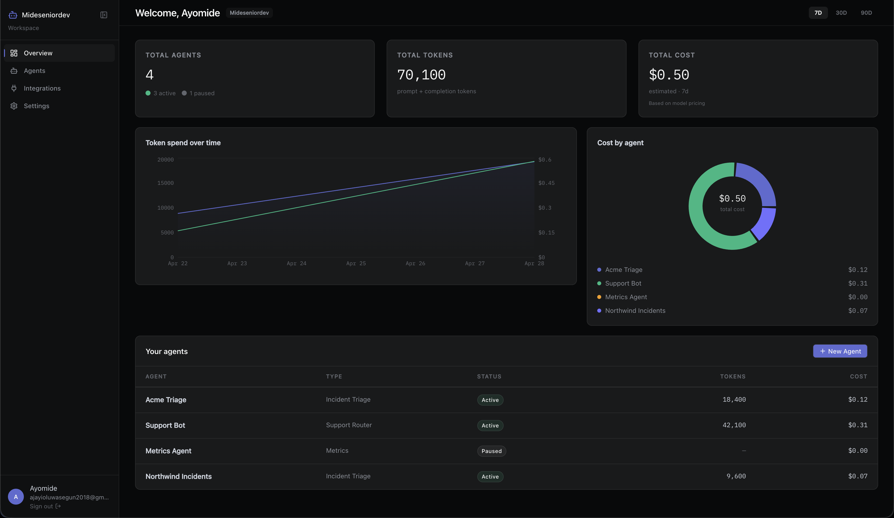
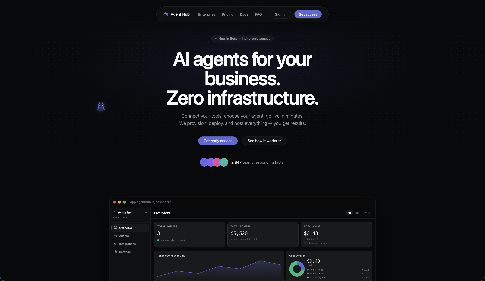
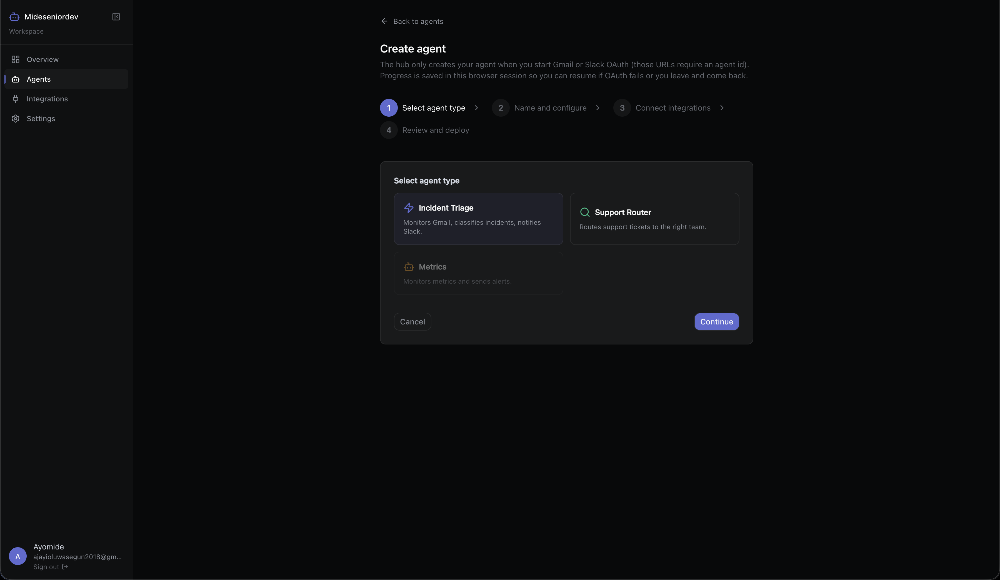
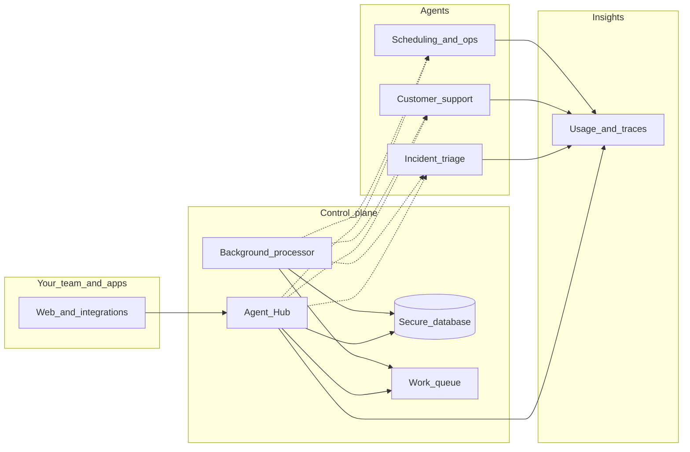

# Agent Hub

**The place your AI agents live, scale, and stay accountable** — so your team can delegate repetitive work to assistants that plug into your tools, respect approvals, and leave a clear trail of what ran.

**Inside the product** — your workspace: agents, token usage, estimated cost, and trends in one view.

---

## Table of contents

1. [Product preview](#product-preview)
2. [Why Agent Hub](#why-agent-hub)
3. [What you can do](#what-you-can-do)
4. [Example agents](#example-agents)
5. [How it works behind the scenes](#how-it-works-behind-the-scenes)
6. [Architecture at a glance](#architecture-at-a-glance)

---

## Product preview

**Marketing & first impression** — Beta positioning, value proposition, and a glimpse of the in-app overview.

**Creating an agent** — Choose a template (incident triage, support router, metrics), then continue through name, integrations, and deploy.

---

## Why Agent Hub

**The problem:** Teams are buried in repetitive work — triaging messages, drafting replies, chasing status, updating systems. Generic chat tools are hard to **govern**, **measure**, and **trust** for real business workflows. One-off scripts and scattered automations don’t scale when you need **visibility**, **retries**, and **who did what**.

**What Agent Hub does:** It gives you a **single home** for AI-powered workflows: register what each assistant is allowed to do, connect the tools it needs, and run work **asynchronously** so nothing blocks your apps or your people. Sensitive steps can wait for **human approval** before anything customer-facing goes out.

**Results for businesses:**

- **Time back** — fewer hours on intake, triage, and follow-ups; people focus on judgment calls and relationships.
- **Consistency** — the same playbook runs every time, with status you can check instead of “someone’s spreadsheet.”
- **Confidence** — approvals, audit-friendly logging, and usage signals so leaders see **volume, cost, and reliability**, not a black box.
- **Room to grow** — start with one high-impact workflow, then add more assistants as you prove value.

Agent Hub is built as a **startup product**: sharp on a few workflows first, with a path to more agents and deeper analytics—not a generic “AI for everything” slide.

---

## What you can do

- **Run multiple assistants** for different jobs (incident triage, support drafts, operations checklists, and more over time).
- **Connect your stack** — email, ticketing, and other integrations so agents work **inside** your processes, not beside them.
- **See what happened** — runs, failures, and cost signals so you can improve workflows and justify the investment.
- **Stay in control** — optional human-in-the-loop for high-impact actions: propose, review, then send.

---

## Example agents

These illustrate the **shape** of the product; shipping focus may start with one and expand.

| Agent | What it helps with |
| --- | --- |
| **Incident triage** | Triage and summarize incoming issues, suggest next steps, and route work so on-call and support teams respond faster with fewer misses. |
| **Customer support** | Draft replies from your knowledge and policies, flag edge cases for a human, and keep tone and facts aligned with how you serve customers. |
| **Scheduling & follow-ups** | Propose times, reminders, and light CRM hygiene so small teams spend less time on coordination and chase. |

The repository today includes a reference **incident triage** agent as the flagship example; the platform is designed so **more agent types** can be added without rebuilding the core.

---

## How it works behind the scenes

You don’t need to be an engineer to grasp the flow:

1. **Your apps and people** talk to **Agent Hub** — the central place that knows your organization, your agents, and what’s allowed.
2. **Agent Hub** keeps the **system of record** (who asked for what, job status, and settings). Long-running work doesn’t tie up your screen; it’s handed to a **background processor** through a **work queue**, so failures can retry safely instead of vanishing.
3. **Each agent** is its own service: it runs the AI steps, tools, and optional “ask a human before sending” flows. That separation keeps the product **stable** as you add or change assistants.
4. **Insights** (runs, quality, cost-style signals) flow into tooling you can use for support and product decisions — so “did the agent help?” has an answer beyond gut feel.

Secrets like API keys stay in **secure storage**, not in messages flying through the queue. The database is always the **source of truth** for status; the queue is the **messenger**, not a second place you have to reconcile.

---

## Architecture at a glance

**Reading the diagram:** The **bold path** through Agent Hub, the database, and the queue is how work is accepted, remembered, and completed reliably. The **lighter lines** to **Agents** are where each assistant does its specialized job. **Insights** captures what ran so you can operate and improve the product with confidence.

---

## For developers

- **[docs/explanatory-brief-for-llms.md](docs/explanatory-brief-for-llms.md)** — Product + technical orientation, stack, and how to use the repo.
- **[docs/architecture.md](docs/architecture.md)** — Components, `agent-hub-core`, Terraform map, observability, security boundaries.
- **[docs/design-decisions.md](docs/design-decisions.md)** — Why we chose each technology, provisioning model, tradeoffs, problems solved.
- **[docs/data-flow.md](docs/data-flow.md)** — Sequence diagrams for sign-up, dashboard, create agent, worker provisioning, integrations.
- **[docs/plan.md](docs/plan.md)** — Phased delivery, dependency checklist, out-of-scope notes.
- **[docs/Agent.md](docs/Agent.md)** — Conventions for contributors and coding agents.
- **[docs/terraform-infra-instructions.md](docs/terraform-infra-instructions.md)** — AWS Terraform bootstrap and apply order.
- **Local orchestration** — [`Makefile`](Makefile) (`make help`, `make local-up`, `make local-provision`). Infra index: [`infra/README.md`](infra/README.md).
