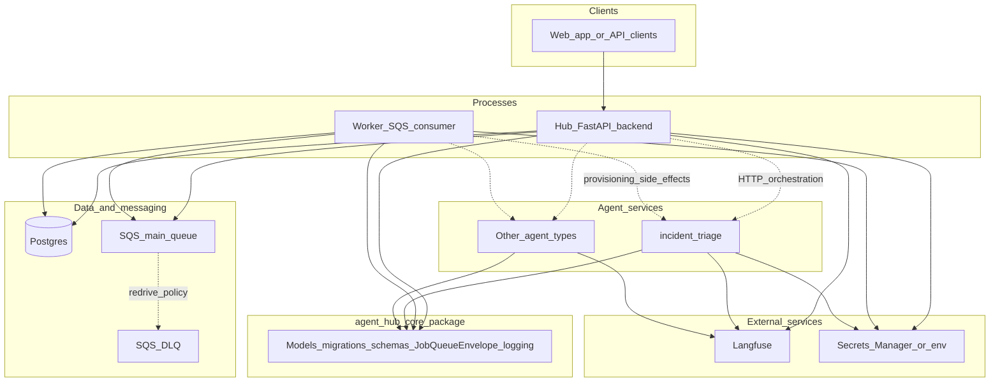
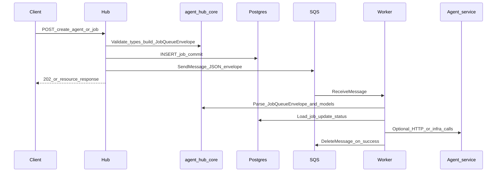

# Agent Hub — system architecture

This document describes **how the system is built and how parts connect**. It pairs with [plan.md](plan.md) (phased scope and dependency checklist) and the product-oriented [README.md](../README.md). For Terraform apply order and bootstrap, use [terraform-infra-instructions.md](terraform-infra-instructions.md) and [infra/README.md](../infra/README.md).

---

## 1. Goals

- **Shared kernel** — one Python package **`agent-hub-core`** holds cross-cutting types, DB schema, migrations, and the job envelope so hub, worker, and agents stay aligned.
- **Control plane** — one HTTP API and database for tenants, agents, jobs, integrations, and dashboard-facing aggregates.
- **Async execution** — slow or flaky work (provisioning, rollups, integration maintenance) must not block API responses; failures must be **retryable** and **observable**.
- **Multiple agents** — the platform models many agent **types**; each agent is a **separate deployable** with its own runtime, tools, and LLM observability.
- **Single source of truth** — Postgres holds authoritative job and registry state; queues carry **pointers**, not parallel truth.
- **Operable infrastructure** — Terraform in **small roots** per deployable, shared modules, and local parity (e.g. LocalStack for SQS in dev).

---

## 2. System context

Typical actors: **browser or API clients** → **Hub**; **Worker** consumes async work; **Agents** run specialized AI workflows; **`agent-hub-core`** is the **shared Python library** (models, migrations, envelope, logging) compiled into hub, worker, and agent processes — not a separate network service. **Postgres** and **SQS** are runtime dependencies; **Langfuse** (or similar) supports traces and cost for LLM paths.

**Solid lines:** Primary request path (hub → DB), enqueue (hub → SQS), consume (worker ↔ SQS, worker → DB), and **import-time dependency** of each process on **`agent-hub-core`**. **Dotted lines:** Orchestration to agents varies by feature; DLQ is fed by SQS redrive policy, not by direct hub writes.

### 2.1 What lives in `agent-hub-core`

[`packages/agent-hub-core/`](../packages/agent-hub-core/) (`import agent_hub_core`) is the **single place** for:

- **SQLAlchemy models** and **Alembic** migrations (schema shared by hub and worker)
- **`JobQueueEnvelope`** and SQS helpers so enqueue and consume cannot drift
- **Pydantic schemas** and **domain** enums / transitions used across services
- **Settings** shape and **structlog** JSON logging helpers for a consistent field contract

The **hub**, **worker**, and **incident-triage** (and future agents) **depend on this package** as a workspace library; deployables remain separate processes and images.

---

## 3. Logical architecture (control plane vs agents)

| Layer | Responsibility | Code / deployable |
| --- | --- | --- |
| **`agent-hub-core`** | Shared **library** (not its own container): settings, ORM models, Alembic migrations, Pydantic schemas, `JobQueueEnvelope`, SQS helpers, observability | [`packages/agent-hub-core/`](../packages/agent-hub-core/) |
| **Hub** | REST API, auth, multi-tenant CRUD, job creation, enqueue, dashboard BFF — **imports** `agent_hub_core` | [`backend/`](../backend/) |
| **Worker** | Long-poll SQS, validate envelope, dispatch by `job_type`, idempotent handlers, AWS-side effects — **imports** `agent_hub_core` | [`worker/`](../worker/) |
| **Agents** | LLM/tool runtime, optional LangGraph HITL, Langfuse instrumentation — **may import** `agent_hub_core` for shared types and config | e.g. [`agents/incident-triage/`](../agents/incident-triage/) |

Hub, worker, and agents **ship as separate artifacts** but **share one kernel package** so envelope shape, DB schema, migrations, and settings names cannot drift between producer and consumer.

---

## 4. Async job lifecycle (provisioning-style flow)

When the API accepts work that should run in the background (for example **agent provisioning**):

1. Hub **validates** input and **commits** a `jobs` row in Postgres (`pending` or moving toward `queued`).
2. Hub **serializes** a [`JobQueueEnvelope`](../packages/agent-hub-core/src/agent_hub_core/messaging/envelope.py) (IDs, `job_type`, `correlation_id`, non-secret `payload`) and calls **SQS SendMessage** when `SQS_QUEUE_URL` is configured.
3. On successful send, the job row reflects **queued**; if the queue is unset or misconfigured, the row can remain **pending** while the API still succeeds — useful for DB-only dev.
4. Worker **receives** the message, parses the envelope, loads the job from Postgres, runs the **registered handler** for that `job_type`, updates job status, and **deletes** the SQS message only after success.
5. Repeated failures or poison messages eventually land in the **DLQ** (configured via Terraform on the main queue’s redrive policy), without the hub writing to the DLQ directly.

---

## 5. Repository layout (engineering map)

| Path | Role |
| --- | --- |
| [`packages/agent-hub-core/`](../packages/agent-hub-core/) | Migrations, models, domain enums, job transitions, `messaging/envelope.py`, SQS helpers, `observability/logging.py` |
| [`backend/`](../backend/) | `main.py`, `apis/*`, `services/*`, middleware |
| [`worker/`](../worker/) | `main.py`, `sqs_transport/`, `handlers/registry.py`, per-job handlers, `handlers/aws/*` |
| [`agents/incident-triage/`](../agents/incident-triage/) | Reference agent service (workspace member) |
| [`infra/`](../infra/) | Terraform modules and **roots** (see below) |
| [`frontend/`](../frontend/) | Dashboard UI (when present) |

Workspace definition: root [`pyproject.toml`](../pyproject.toml) (**uv** members: core, backend, worker, incident-triage).

---

## 6. Infrastructure (Terraform)

Design intent: **one Terraform root per deployable** (or per concern), shared building blocks under `infra/modules/`, and **chained outputs** via `terraform_remote_state` where stacks depend on each other.

| Root / area | Typical purpose |
| --- | --- |
| [`infra/vpc/`](../infra/vpc/) | Network foundation |
| [`infra/rds/`](../infra/rds/) | Managed Postgres |
| [`infra/hub/`](../infra/hub/) | Hub compute (e.g. App Runner module) |
| [`infra/worker/`](../infra/worker/) | Worker on ECS, EventBridge schedules as needed |
| [`infra/agents/incident-triage/`](../infra/agents/incident-triage/) | Agent service infrastructure |
| [`infra/secrets/`](../infra/secrets/) | Secrets wiring |
| [`infra/ci-oidc/`](../infra/ci-oidc/) | GitHub Actions OIDC for deploy roles |
| [`infra/localstack/`](../infra/localstack/) | Local SQS (+ related IAM/outputs) for development |
| [`infra/modules/*`](../infra/modules/) | Reusable modules (SQS, RDS, VPC, App Runner, ECS worker, secrets, etc.) — **not** a standalone apply target |

Exact resource names and apply order evolve with the repo; treat [`infra/README.md`](../infra/README.md) and [`terraform-infra-instructions.md`](terraform-infra-instructions.md) as the operational source of truth.

---

## 7. Observability

- **Logs:** **structlog** → JSON from a shared module in `agent-hub-core`, with a **shared field contract** (`service`, `correlation_id` / request id, `job_id`, `tenant_id` when known) so hub, worker, and agents correlate in CloudWatch or local aggregators.
- **LLM / product analytics:** **Langfuse** (and/or hub DB rollups) for traces, cost, and latency — see [plan.md](plan.md) for dashboard and KPI direction.

---

## 8. Security boundaries (summary)

- **No secrets in SQS bodies** — only stable identifiers and non-secret metadata; see `JobQueueEnvelope` docstring and validators on job create payloads.
- **Secrets at runtime** — AWS Secrets Manager (or local env) with **least-privilege IAM** on hub vs worker vs agent tasks.
- **Multi-tenancy** — tenant-scoped rows and integration references (e.g. secret ARNs), not cross-tenant identifiers in messages.

---

## 9. Related documentation

| Document | Use |
| --- | --- |
| [explanatory-brief-for-llms.md](explanatory-brief-for-llms.md) | What Agent Hub is, problems solved, stack, decisions — for LLMs and onboarding |
| [design-decisions.md](design-decisions.md) | Technologies, provisioning model, tradeoffs, decision log |
| [data-flow.md](data-flow.md) | Sequence diagrams: auth, dashboard, create agent, worker, Gmail OAuth |
| [plan.md](plan.md) | Platform plan, execution phases, dependency table |
| [Agent.md](Agent.md) | Contributor and automation conventions |
| [terraform-infra-instructions.md](terraform-infra-instructions.md) | Terraform roots, apply order, bootstrap |
| [infra/README.md](../infra/README.md) | Infra layout index |

---

_Last updated to reflect the documented platform shape (hub, worker, core, agents, SQS, Postgres, Terraform roots). Update diagrams when the default hub runtime or queue topology changes materially._
