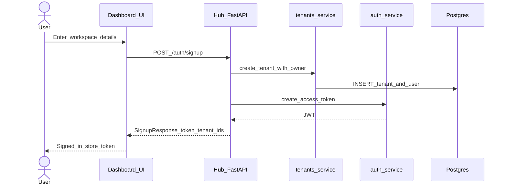
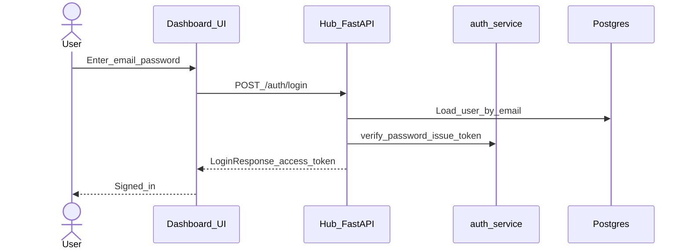
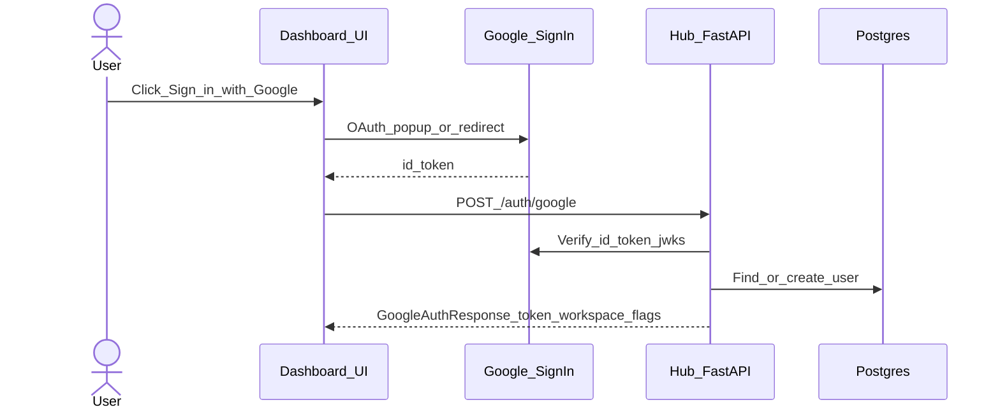
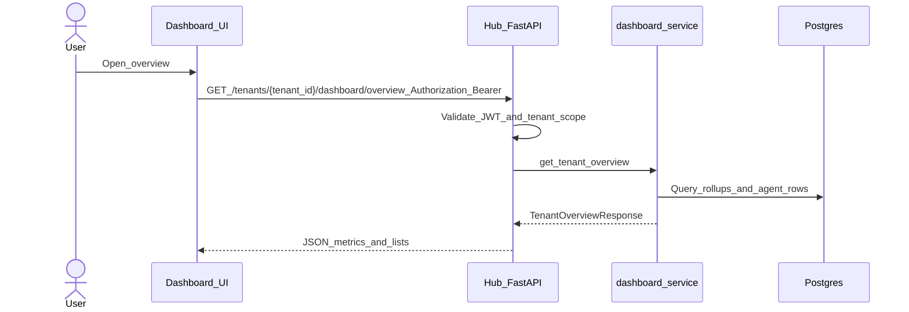
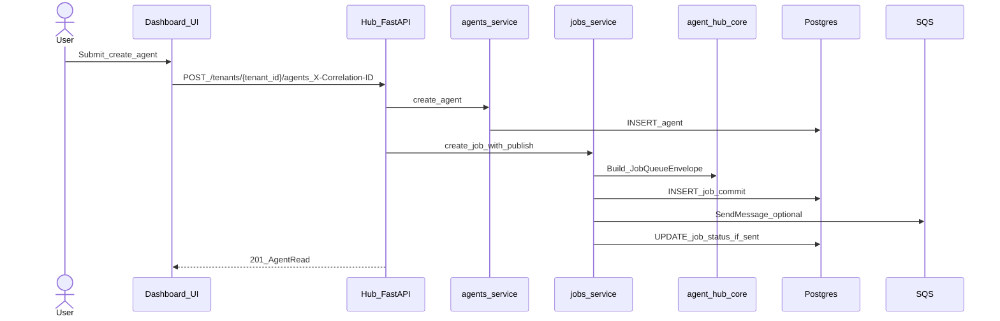
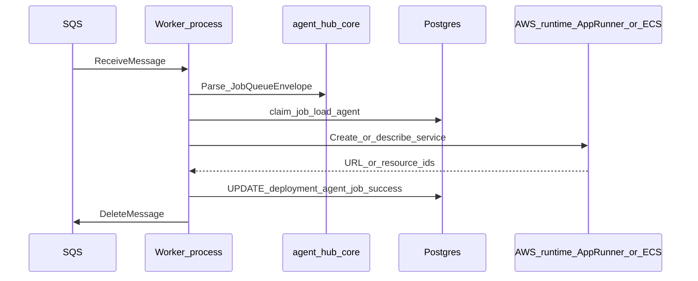
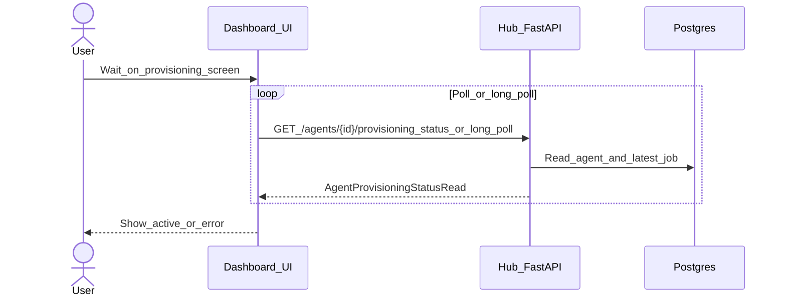
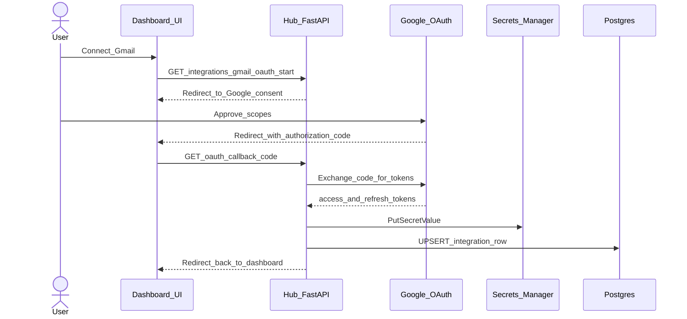

# Agent Hub — data flows and user interactions

This document shows **how important actions move through the system** using sequence diagrams. It complements [architecture.md](architecture.md) (components and boundaries) and [design-decisions.md](design-decisions.md) (why). API prefixes follow the hub’s versioned routes (typically `/api/v1`).

---

## Table of contents

1. [Create workspace (sign up)](#1-create-workspace-sign-up)
2. [Sign in (email password)](#2-sign-in-email-password)
3. [Sign in with Google (hub account)](#3-sign-in-with-google-hub-account)
4. [Open dashboard overview](#4-open-dashboard-overview)
5. [Create an agent](#5-create-an-agent)
6. [Background: provision an agent](#6-background-provision-an-agent)
7. [Track provisioning from the UI](#7-track-provisioning-from-the-ui)
8. [Connect Gmail for an agent](#8-connect-gmail-for-an-agent)

---

## 1. Create workspace (sign up)

A new customer submits **workspace name**, **email**, **name**, and **password**. The hub creates a **tenant** and **owner user** in one transaction, then returns a **hub JWT** so the browser can call tenant-scoped APIs.

**Notes:** Slug collisions are retried server-side. If `JWT_SECRET_KEY` is missing, the hub returns **503** (see [`backend/apis/auth.py`](../backend/apis/auth.py)).

---

## 2. Sign in (email password)

Returning users send **email + password**; the hub validates credentials and issues the same style of **access token** as sign-up.

---

## 3. Sign in with Google (hub account)

The **dashboard** uses Google’s **Sign-In** SDK; the browser sends a Google **`id_token`** to the hub. The hub **verifies** the token with Google’s public keys, then **finds or creates** a `User`. New Google users may have **no tenant** yet (`has_workspace=false`) until they complete workspace creation — a separate flow from **Gmail agent OAuth** (section 8).

---

## 4. Open dashboard overview

The **overview** screen (agents, tokens, cost) calls a **tenant-scoped** dashboard route. The hub checks the **Bearer JWT**, ensures the path `tenant_id` matches the token, then reads **aggregates from Postgres**.

**Related routes:** Per-agent drill-down under `/tenants/{tenant_id}/dashboard/agents/{agent_id}/…` (see [`backend/apis/dashboard.py`](../backend/apis/dashboard.py)).

---

## 5. Create an agent

When the user finishes the **create agent** wizard, the UI **`POST`s** the new agent. The hub **inserts** the `agents` row, then creates a **`jobs`** row for `agent_provisioning` and **publishes** a `JobQueueEnvelope` to **SQS** when configured. The HTTP response is the **agent record**; provisioning continues **asynchronously**.

**If `SQS_QUEUE_URL` is unset:** the job may stay **`pending`** while the agent row still exists — useful for local API-only testing ([`services/jobs_service.py`](../backend/services/jobs_service.py)).

---

## 6. Background: provision an agent

The **worker** long-polls **SQS**, parses the envelope with **`agent_hub_core`**, loads the **job** and **agent**, then runs the **`agent_provisioning`** handler (App Runner / ECS / dev URL depending on settings). It updates **job status** and **agent/deployment** rows in **Postgres**, then **deletes** the SQS message on success.

**Failure path:** On repeated errors, SQS redrives until the message lands on the **DLQ**; the job row can move to **failed** / **dead_lettered** depending on handler logic ([`worker/handlers/provision.py`](../worker/handlers/provision.py)).

---

## 7. Track provisioning from the UI

The UI can **`GET`** provisioning status or **long-poll** until the watermark changes, so the “Create agent” experience can show **spinner → active** without blocking the original `POST`.

---

## 8. Connect Gmail for an agent

**Gmail OAuth** (agent integration) is separate from **Google Sign-In** (section 3). The user starts OAuth from the hub; the hub redirects to **Google**, then handles the **callback**: exchanges the **code** for tokens, stores secrets in **AWS Secrets Manager**, and updates the **`integrations`** row. Optionally, **Gmail watch** is registered when Pub/Sub is configured.

**Slack:** The same **start URL → OAuth provider → callback → secrets + DB** pattern applies under [`backend/apis/integrations_slack.py`](../backend/apis/integrations_slack.py).

---

## Related documentation

| Document | Use |
| --- | --- |
| [architecture.md](architecture.md) | System context, `agent-hub-core`, Terraform map |
| [design-decisions.md](design-decisions.md) | Rationale for async jobs, queues, shared library |
| [explanatory-brief-for-llms.md](explanatory-brief-for-llms.md) | Compact problem/solution narrative |

---

_Update this file when new first-class user journeys ship or route shapes change._
