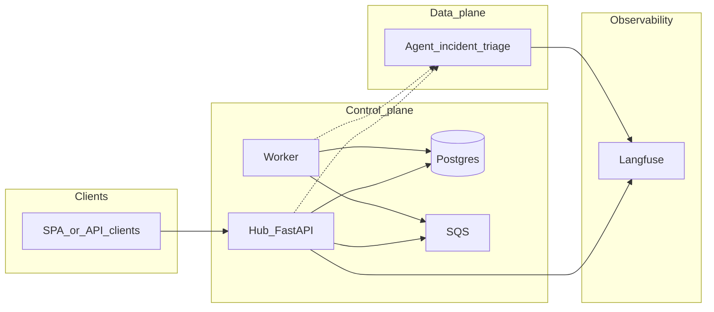

# Agent Hub — explanatory brief for LLMs

This document orients language models and new contributors to **what Agent Hub is**, **which problems it solves**, **how the system is shaped**, and **why key technical choices were made**. It complements the executable plan in [`plan.md`](plan.md), the contributor contract in [`Agent.md`](Agent.md), **system diagrams** in [`architecture.md`](architecture.md), **user-facing data flows** in [`data-flow.md`](data-flow.md), **rationale and tradeoffs** in [`design-decisions.md`](design-decisions.md), and operational detail in [`infra/README.md`](../infra/README.md) and [`terraform-infra-instructions.md`](terraform-infra-instructions.md). The root [`README.md`](../README.md) is **product-oriented** for visitors; engineers should use the links above for runbooks and stack detail.

---

## 1. Business context

**Agent Hub** is a **multi-tenant control plane** for running **AI agents** as first-class products inside an organization. Tenants (e.g. customer orgs) register agents, trigger lifecycle and async work, and eventually consume **usage and reliability signals** without treating each agent as a one-off script.

**Primary stakeholders**

- **Platform operators** — deploy hub, worker, queues, database, and agent services; enforce IAM, networking, and secrets policy.
- **Tenant admins / builders** — create agents (by type), connect integrations (OAuth-backed tools such as Gmail, GitHub, ticketing), and interpret operational dashboards.
- **End users** (often internal) — interact with a specific agent product (the capstone focuses on **incident triage**).

**Product themes called out in the plan**

- **Registry and lifecycle** — agents are modeled in Postgres (type, status, deployment metadata); provisioning and updates are **asynchronous** so the HTTP API stays fast and failures are retriable.
- **Observability as a product feature** — traces and generations (via **Langfuse**) support debugging and cost/latency awareness; **business-facing KPIs** (e.g. estimated hours saved on triage) are intended to be **rolled up into the hub database** for dashboard APIs, not only raw Langfuse UI.
- **Human-in-the-loop (HITL)** — sensitive or high-impact agent steps can pause for approval; the capstone scopes **LangGraph** interrupt/resume patterns to the **`incident-triage`** agent only, keeping the platform diagram simple.

**Capstone constraint** — Ship **one** agent implementation on the critical path: [`agents/incident-triage/`](../agents/incident-triage/). The hub schema may still describe multiple agent **types** for narrative and future expansion, but additional agent folders are **post-capstone**.

---

## 2. Technical problems being solved

| Problem | How Agent Hub addresses it |
| --- | --- |
| **Coupling synchronous HTTP to slow or flaky side effects** (ECS updates, rollouts, rollups) | Hub persists a **job** row, enqueues a **non-secret JSON envelope** to **SQS**, returns quickly; a **worker** applies side effects and updates job status. |
| **Secrets leaking into logs or queues** | **Postgres** is authoritative for job state; SQS payloads carry **IDs and routing metadata only** (`JobQueueEnvelope`). OAuth and API keys live in **Secrets Manager** (AWS) or local env; **never** embed tokens in queue bodies. |
| **Duplicate or poison messages** | SQS **at-least-once** delivery: worker uses **`job_id`** for **idempotency**; a **DLQ** catches repeated failures after `maxReceiveCount`. |
| **Local vs cloud drift** | Same **boto3** code path: local dev sets **`AWS_ENDPOINT_URL`** (e.g. LocalStack); production leaves it unset and uses IAM task roles. |
| **Cross-service incident response** | **Structured JSON logging** (e.g. structlog) with a **shared field contract** (`service`, `correlation_id`, `job_id`, `tenant_id` when known) so hub → queue → worker → agent can be correlated in CloudWatch or local logs. |
| **Tenant isolation** | Data model is multi-tenant; integrations reference **secret ARNs** and scoped naming; Langfuse strategy favors **tags/projects per tenant** where policy requires. Advanced pattern: dedicated ECS stacks per regulated tenant (documented as optional). |
| **Shared invariants between hub and worker** | A single Python package **`agent-hub-core`** holds settings, DB models, Alembic migrations, Pydantic schemas, SQS helpers, and the **canonical job envelope** so enqueue and consume cannot silently diverge. |

---

## 3. System architecture (logical)

**Control plane** — FastAPI **hub** (`backend/`): REST API, auth, tenants, agents, jobs, dashboard BFF. **Postgres** stores registry and job metadata. **SQS** is the async pipe to the **worker**.

**Data plane** — **Agents** are separate deployables (containers), e.g. **incident-triage**: own HTTP surface, LLM/tool runtime, Langfuse instrumentation, optional LangGraph HITL. The hub (or worker, depending on the chosen flow) coordinates **when** an agent runs or gets provisioned; agents do not embed the full platform.

**Infrastructure** — **Per-service Terraform roots** (e.g. `infra/hub/`, `infra/worker/`, `infra/agents/incident-triage/`, `infra/localstack/` for dev) plus shared **`infra/modules/`**. CI builds **ECR images** per component; apply order respects dependencies (queues/RDS owning stack → consumers).

Solid lines show the **primary** persistence and async path; dotted lines represent **HTTP or orchestration** edges that vary by feature (direct hub→agent vs worker-driven provisioning).

---

## 4. Repository layout (high level)

| Path | Role |
| --- | --- |
| [`packages/agent-hub-core/`](../packages/agent-hub-core/) | Shared kernel: `pydantic-settings`, SQLAlchemy async models, Alembic, `JobQueueEnvelope`, SQS client shape, structlog helpers, domain enums/schemas. |
| [`backend/`](../backend/) | Hub only: `main`, `apis/`, `services/` — depends on `agent-hub-core`. |
| [`worker/`](../worker/) | Long-running SQS consumer, handler registry, AWS adapter stubs — depends on `agent-hub-core`. |
| [`agents/incident-triage/`](../agents/incident-triage/) | Capstone agent service (workspace member). |
| [`infra/`](../infra/) | Terraform: modules + per-deployable roots; LocalStack-oriented dev under `infra/localstack/`. |
| [`docs/plan.md`](plan.md) | Versioned execution plan, target tree, dependency table, diagram policy. |

Root **`pyproject.toml`** defines a **[uv workspace](https://docs.astral.sh/uv/concepts/projects/workspaces/)** so `uv sync` installs **agent-hub-core**, **agent-hub-backend**, **agent-hub-worker**, and **agent-hub-incident-triage** consistently.

---

## 5. Stack

| Layer | Choice | Notes |
| --- | --- | --- |
| Language | **Python ≥ 3.11** | Async-first hub and worker. |
| Packaging | **uv** workspace | Editable members; `uv run --package …` for scoped commands. |
| Hub framework | **FastAPI** + **Uvicorn** | HTTP API, lifespan hooks for DB pool / clients. |
| Data access | **SQLAlchemy 2** + **asyncpg** | Async engine; migrations via **Alembic** in core. |
| Config | **pydantic-settings** | `.env` loading documented in README (root + `backend/.env`). |
| Async messaging | **AWS SQS** (boto3) | LocalStack or ElasticMQ locally; DLQ via redrive policy. |
| Logging | **structlog** → JSON | Shared observability module in core; `service` discriminates hub vs worker vs agent. |
| Agent / LLM ops | **Langfuse** (planned/integrated per plan) | Tracing and cost; tenant tagging conventions in plan and Agent.md. |
| HITL (capstone agent) | **LangGraph** | Interrupts/checkpoints/resume — **agent-local** concern. |
| Infra as code | **Terraform** | Small roots per service; `terraform_remote_state` where outputs chain. |
| Containers | **Docker** + **docker compose** | Local-first: Postgres, LocalStack, hub, worker, agent. |

Optional or phased: **API Gateway**, **App Runner** vs **ECS Fargate**, **frontend** dashboard app, **vector DB / RAG** — see plan sections on hybrid traffic and RAG.

---

## 6. Technical decisions (and rationale)

1. **Monorepo with a shared core package** — Avoids duplicate job schemas, settings names, and migration drift between hub and worker; one place defines `JobQueueEnvelope` and DB truth for `jobs`.

2. **Postgres as source of truth for job state** — Queue messages are notifications; status transitions and idempotency keys live in the database so retries and admin queries do not depend on peeking SQS.

3. **Explicit job envelope (Pydantic)** — [`packages/agent-hub-core/src/agent_hub_core/messaging/envelope.py`](../packages/agent-hub-core/src/agent_hub_core/messaging/envelope.py) documents the JSON contract (`job_id`, `tenant_id`, `job_type`, `correlation_id`, optional `agent_id`, non-secret `payload`).

4. **Hub may omit `SQS_QUEUE_URL`** — Jobs stay `pending` when the queue is unset, allowing REST + DB development without LocalStack.

5. **Per-service Terraform roots** — Blast radius and CI path filters align with **one deployable per stack**; shared code only under `infra/modules/` (no standalone apply there).

6. **Structured logging from T0** — Required for capstone demos and production support; not deferred to “after AWS.”

7. **Secrets out of band** — ARNs and metadata in DB/job payloads; **GetSecretValue** at runtime in the right task role; aligns with least-privilege and audit requirements.

8. **LangGraph detail stays out of the main architecture diagram** — Keeps the platform story readable; HITL sequences live in appendix-style docs per plan policy.

9. **Alembic migrations owned by core** — Single migration stream for hub + worker shared schema; run via documented `uv run --package agent-hub-core alembic …` (avoid ad hoc multi-replica migrate on ECS without coordination).

---

## 7. What this project is _not_ (v1 / capstone)

From [`plan.md`](plan.md): multi-region active-active; arbitrary tenant-supplied container images without supply-chain review; unreviewed in-task MCP servers; full visual LangGraph designer unless product explicitly demands it.

---

## 8. How an LLM should use this repo

- **Implement against** [`docs/plan.md`](plan.md) and [`docs/Agent.md`](Agent.md) for scope, ordering (**local-first before Terraform**), and logging/secrets rules.
- **Run and verify** using [`infra/README.md`](../infra/README.md) and [`terraform-infra-instructions.md`](terraform-infra-instructions.md) (`make local-up`, `make local-provision`, worker `uv run python -m worker`, etc.).
- **Prefer extending** `agent-hub-core` for cross-cutting types and `backend/apis` / `worker/handlers` for behavior rather than parallel conventions.
- **When editing infra**, respect per-root ownership and documented apply order; do not collapse unrelated services into one Terraform root without an explicit plan change.

---

_Last aligned with repository state and `docs/plan.md` narrative. Update this brief when the product scope or default runtime (e.g. hub on App Runner vs ECS) changes materially._
