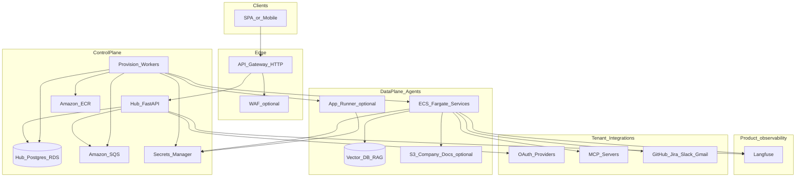

# Agent Hub — plan and platform reference

This file is the **version-controlled platform plan**. It complements [`architecture.md`](architecture.md) (diagrams and structure) and [`Agent.md`](Agent.md) (contributor conventions). Operational Terraform steps live in [`terraform-infra-instructions.md`](terraform-infra-instructions.md).

---

## Context

The **hub** is a **FastAPI** control plane: one client-facing API, **Postgres** for registry and jobs, **SQS** for async handoff to a **worker**, and **agents** as **separate containers** (reference implementation: [`agents/incident-triage/`](../agents/incident-triage/)). **Secrets** use env / `.env` locally and **Secrets Manager** in AWS — never inline in SQS bodies. **Structured JSON logging** (e.g. structlog) with a **shared field contract** across hub, worker, and agents enables cross-service correlation in CloudWatch or local logs.

**Observability:** tenants benefit from traces and cost/latency signals (**Langfuse** or equivalent). **Business-facing KPIs** (e.g. estimated time saved, run counts) should be **materialized or aggregated in the hub database** for dashboard APIs, not only ad hoc analytics UIs.

**Agent runtime:** agents may implement **human-in-the-loop (HITL)** with **LangGraph** (interrupts, checkpoints, resume). That stays **per-agent** detail: mention in [`architecture.md`](architecture.md) text or appendix, not as a large node graph on the primary system diagram.

**Agent breadth:** the repo ships **incident-triage** as the primary example agent; the hub schema can still model **multiple agent types** for growth. Add more under `agents/` using the same pattern when needed.

---

## Local-first: hub, Postgres, and SQS

**Order:** Prove **hub ↔ SQS ↔ worker** and **hub → Postgres** locally (`docker compose` or host + compose dependencies) **before** relying on full AWS Terraform. Same **boto3 SQS** API and **JSON job envelope** locally and in production — only `AWS_ENDPOINT_URL` and credentials differ.

### Hub (`backend/`) — FastAPI

- **Lifespan** opens DB pool and optional SQS client.
- **Settings** (`pydantic-settings`): `DATABASE_URL`, `SQS_QUEUE_URL`, `SQS_DLQ_URL` (optional), `AWS_REGION`, `AWS_ENDPOINT_URL` (empty in prod, set for LocalStack), dummy keys for LocalStack only when required.
- **Routers** enqueue work: persist job → **`sqs.send_message`** with **`job_id`** / idempotency; **never** put OAuth secrets in the message body.
- **Observability:** structlog → JSON; HTTP **request_id**; **`service=hub`**, **`correlation_id`**; log `message_id` and queue URL on enqueue (not secrets).

### Worker (`worker/`)

- Same logging contract: **`service=worker`**, **`correlation_id`** (from envelope or new UUID), **`job_id`**.
- Long poll **`receive_message`**, parse body, handle, **`delete_message`** on success; DLQ / visibility semantics as documented for your environment.
- **Idempotency** on `job_id` so at-least-once delivery does not double-apply side effects.

### Agents (`agents/incident-triage/`)

- Same field contract: **`service=incident_triage`** (or `agent`), **`correlation_id`**, **`tenant_id`** / **`run_id`** when known. Langfuse complements logs; it does not replace structured logs.

### Local queues

- **LocalStack** in `docker-compose.yml` is typical; **`AWS_ENDPOINT_URL`** points at the emulator from hub/worker containers.
- **ElasticMQ** is a lighter alternative if you only need SQS-shaped APIs.

### Compose and Docker

- Services: **`postgres`**, queue emulator, **`hub`** (`backend/Dockerfile`), **`worker`**, optional **agent** when needed.
- Hub image should match what you run in AWS (same Dockerfile artifact); host-run `uvicorn` against compose infra is optional for fast iteration.

### Database

- **Never** bundle Postgres inside the hub container in production. Hub is **stateless** aside from pools; durability is the database’s job.
- **Alembic** migrations live in **`packages/agent-hub-core`**; run via an explicit **Makefile / CI** migrate step — avoid uncoordinated migrate-on-startup on multiple hub replicas in production.

---

## Diagram policy (`architecture.md`)

- **Main diagrams:** essentials only — include a single logical **Langfuse** (or product observability) node with edges from hub and agents; avoid LangGraph subgraphs and per-widget dashboard flows on the primary figure.
- **Detail:** Langfuse tenancy, LangGraph resume flows, KPI formulas, and BFF contracts belong in **dedicated sections** or an **appendix**.

---

## Target repository layout

Conventions: **`backend/`** = hub image; **`worker/`** = async worker image; **`agents/incident-triage/`** = reference agent image. **`packages/agent-hub-core/`** = shared kernel (settings, DB, migrations, `JobQueueEnvelope`, logging). **`infra/`** = **one Terraform root per deployable** (`infra/hub/`, `infra/worker/`, `infra/agents/incident-triage/`, optional `infra/frontend/`, **`infra/localstack/`** for dev); shared blocks under **`infra/modules/`** (not standalone apply targets).

```text
agent-hub/
├── .github/workflows/
├── agents/
│   └── incident-triage/
├── backend/
├── worker/
├── packages/agent-hub-core/
├── infra/
│   ├── hub/
│   ├── worker/
│   ├── agents/incident-triage/
│   ├── localstack/
│   ├── modules/
│   ├── vpc/
│   ├── rds/
│   ├── secrets/
│   └── ci-oidc/
├── docs/
│   ├── plan.md
│   ├── architecture.md
│   ├── Agent.md
│   └── terraform-infra-instructions.md
├── docker-compose.yml
├── Makefile
└── README.md
```

**CI path filters (conceptual):** changes under **`backend/`** or **`infra/hub/`** → hub image + hub stack; **`worker/`** or **`infra/worker/`** → worker; **`agents/incident-triage/`** or **`infra/agents/incident-triage/`** → agent; **`infra/localstack/`** → dev emulated AWS. When queues or VPC/RDS are new, apply the stack that **owns** those resources before consumers that read outputs via **`terraform_remote_state`**.

---

## Target architecture (logical)



**Isolation patterns**

- **Default (shared multi-tenant):** fewer ECS services; strict **per-tenant secret namespaces** and allowlists; every agent request carries `tenant_id` and short-lived credentials where applicable.
- **Advanced:** dedicated ECS service or account boundary for regulated tenants; same orchestration patterns, different stack identifiers.

---

## Execution phases (what to build, in order)

1. **Monorepo layout** — `docker-compose` with Postgres + SQS emulator + hub + worker; optional agent service. Prove **hub → SQS → worker → DB** before expanding Terraform. Separate Terraform roots after local parity is real.
2. **Hub data model** — tenants, users, agents, deployments, integrations (`secret_arn`, not raw tokens), jobs with a clear state machine; Alembic from day one.
3. **Single client-facing API** — agents, OAuth callbacks, job enqueue; dashboard routes tenant-scoped; never return long-lived third-party tokens outside the OAuth flow.
4. **Async orchestration** — same **JSON envelope** locally and in AWS; worker updates Postgres; DLQ policy documented.
5. **Secrets handoff** — naming convention for Secrets Manager paths; ECS task `secrets` mapping; job payloads carry **ARNs and references**, not secret values; Langfuse keys via Secrets Manager with tenant/project strategy documented.
6. **CI/CD** — GitHub Actions **OIDC → AWS**; path filters per app + matching `infra/*` root; gated `terraform apply`; hub does not clone agent source — only image URI + IAM.
7. **Networking** — start with API Gateway → hub; optional hybrid **hub-issued JWT** for agent ingress.
8. **RAG (optional later)** — one vector store choice; ingestion ownership documented in `architecture.md`.
9. **Observability** — structured logs everywhere; CloudWatch on AWS; Langfuse (or OTel) on LLM paths with mandatory tags (`tenant_id`, `agent_id` / `agent_type`, `deployment_env`); dashboard BFF reads hub DB rollups and optionally Langfuse HTTP APIs; explicit PII policy.
10. **Simplified metrics** — KPI definitions per agent type; scheduled worker pulls aggregates and writes rollup rows for fast reads.
11. **HITL** — LangGraph inside the agent that needs it; resume endpoints and hub proxy/auth patterns documented in `architecture.md` appendix.

---

## Dependency list (services and “depends on”)

| Service / component | Role | Depends on |
| --- | --- | --- |
| **Route 53** (optional) | DNS | ACM |
| **ACM** | TLS | DNS validation if used |
| **API Gateway (HTTP)** | Public edge for hub | ACM, VPC link if private ALB |
| **WAF** (optional) | Rate limit / OWASP | API Gateway or ALB |
| **Hub (App Runner / ECS)** | Client API, enqueue jobs | ECR image, task/instance role → SQS, RDS, Secrets Manager |
| **Hub RDS (Postgres)** | Registry, jobs, KPI rollups | VPC, security groups |
| **SQS** (+ **DLQ**) | Async work | IAM for producers and consumers |
| **Worker (ECS Fargate)** | Provisioning, rollups | SQS, ECS/App Runner APIs, IAM pass-role, ECR read, RDS, HTTPS to Langfuse if used |
| **ECR** | Images | IAM push/pull |
| **ECS / App Runner (agents)** | Agent runtimes | ECR, execution + task roles, Secrets Manager, optional vector store / S3 |
| **ALB** (if used) | Agent ingress | TG, health checks, SGs |
| **Secrets Manager** | OAuth refresh, API keys, Langfuse keys | KMS (recommended), IAM policies |
| **Vector DB** (optional) | RAG | VPC / data policies, agent role |
| **S3** (optional) | Doc blobs | IAM |
| **CloudWatch Logs** | Log aggregation | ECS execution role |
| **X-Ray** (optional) | Tracing | IAM, SDK |
| **Langfuse** | Traces, scores, API | Keys in Secrets Manager; egress if self-hosted |
| **IdP (Cognito / Auth0 / etc.)** | End-user identity | Hub validates tokens |
| **External SaaS** | OAuth + APIs | Hub redirect URIs and apps |
| **Terraform state (S3 + DynamoDB)** | Remote state + locks | IAM, encryption |
| **GitHub Actions OIDC** | CI without static keys | IAM trust for `token.actions.githubusercontent.com` |

**Logical “spin up agent” chain:** Client → API Gateway → Hub → (DB + secret refs) → SQS → Worker → (ECS / App Runner update, health wait) → Hub DB reflects **agent base URL** → client polls or webhook.

---

## Out of scope for v1

- Multi-region active-active.
- Self-serve arbitrary tenant-supplied container images without supply-chain controls.
- MCP servers in-process without network policy review.
- Full LangGraph visual designer UI (unless explicitly required).

---

## Maintenance

Update [`architecture.md`](architecture.md) when topology or defaults change. Keep [`Agent.md`](Agent.md) aligned with this plan for contributor and automation onboarding.
