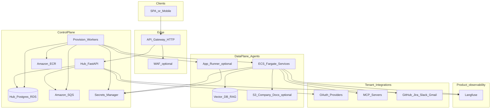

# Agent hub: execution plan and architecture doc

This file is the **version-controlled project plan** at [`docs/plan.md`](plan.md). If a Cursor-managed copy exists under `.cursor/plans/`, keep them aligned when you change scope.

## Context

The repo today is a stub: [backend/](../backend/) (placeholder modules), [architecture.md](architecture.md) (empty mermaid). The **hub** is implemented in **FastAPI** (Python): control plane + single client-facing API. This plan encodes: **hub ↔ worker over SQS** (same pattern locally with LocalStack/ElasticMQ and in AWS with real SQS), **agents = separate containers/images** (`agents/incident-triage` for capstone), **secrets** (env + `.env` locally; **Secrets Manager** in AWS—not inline in SQS bodies), **Postgres** for registry and jobs, **structured logging** in **every** runtime service (hub, worker, incident-triage) with a **shared log field contract** for cross-service tracing, **optional RAG** later, **hybrid traffic** when you add agent ALB/JWT.

**Product observability (new):** tenants and users need a **custom observability dashboard** backed by **Langfuse** to monitor **agent usage and production behavior** (traces, generations, costs, latency, tool errors). The hub should also support **simplified, business-facing metrics** derived from Langfuse (examples: hours saved on incident triage, deflection rate, runs per week)—computed or materialized in the hub DB, not drawn as ten boxes on the architecture diagram.

**Agent runtime (new):** each agent may implement **human-in-the-loop (HITL)** using **LangGraph** (interrupts, checkpoints, resume). That is **per-agent implementation detail**; the architecture doc should mention it in text (and optionally a small sequence “approval resume”) but **not** expand the main system context diagram with LangGraph node graphs.

**Capstone agent scope:** Ship **exactly one** agent implementation—[`agents/incident-triage/`](../agents/incident-triage/)—as the only agent ECR image and ECS service on the critical path. The hub may still model **multiple agent types** in schema for narrative (“platform for many agents”), but **do not** build or deploy additional agent folders before Friday. Post-capstone, add more under `agents/` using the same pattern.

## Local-first: FastAPI hub and SQS to worker (start here)

**Order of execution:** Prove **hub ↔ SQS ↔ worker** and **hub → Postgres** on your laptop (or single `docker compose`) **before** opening [`infra/`](../infra/) Terraform for AWS. Same **boto3 SQS API** and message shape locally and in cloud later—only `AWS_ENDPOINT_URL` / credentials change.

**Hub ([`backend/`](../backend/)) — FastAPI**

- App factory or `main.py`: **lifespan** opens DB pool and optional SQS client.
- **Settings** (`pydantic-settings`): `DATABASE_URL`, `SQS_QUEUE_URL`, `SQS_DLQ_URL` (optional), `AWS_REGION`, `AWS_ENDPOINT_URL` (empty in prod, set for LocalStack), `AWS_ACCESS_KEY_ID` / `AWS_SECRET_ACCESS_KEY` (dummy for LocalStack only).
- **Routers:** e.g. `POST /jobs` or `POST /agents/{id}/provision` → builds JSON body → **`sqs.send_message`** (include **`job_id`** / idempotency key in body; **never** put OAuth secrets in the message).
- **Observability:** **structured logging** (e.g. structlog → JSON); **HTTP `request_id`** middleware; include **`service=hub`**, **`correlation_id`** (propagate from header or generate); on enqueue log **`message_id`**, queue URL (not secrets).

**Worker ([`worker/`](../worker/))**

- **Structured logging** same contract: **`service=worker`**, **`correlation_id`** (from SQS message body if hub sent it, else new UUID per receive), **`job_id`** from payload; log **`receipt_handle`** only at debug if needed (avoid in prod).
- Long-running process: **`receive_message`** loop (wait time 10–20s), parse body, call handler, **`delete_message`** on success; on failure optionally **send to DLQ** or let visibility timeout retry (document semantics).
- **Idempotency:** use `job_id` in DB unique constraint or conditional update so duplicate deliveries do not double-apply.

**Agent ([`agents/incident-triage/`](../agents/incident-triage/)) — logging**

- **Structured logging** with the **same field contract** as hub/worker: **`service=incident_triage`** (or `agent`), **`correlation_id`** on every HTTP handler and graph step (accept `X-Correlation-ID` or body field when hub forwards), **`tenant_id`** / **`run_id`** when known. Langfuse complements logs; it does not replace them.

**Local SQS (pick one, document in README)**

- **LocalStack** in `docker-compose.yml`: SQS + optional SNS; use `AWS_ENDPOINT_URL=http://localstack:4566` from hub/worker containers; **init script** (`awslocal` or AWS CLI against endpoint) creates main queue + DLQ on compose up.
- **Alternative:** lighter **ElasticMQ**-only image if you want minimal dependencies (still SQS-compatible API for boto3 with custom endpoint).

**Compose topology (minimal)**

- Services: **`postgres`**, **`localstack`** (or elasticmq), **`hub`** (build `backend/Dockerfile`), **`worker`**, optionally **`incident-triage`** once the agent exists.
- Hub and worker **depend_on** postgres + queue; **healthchecks** on postgres and queue before hub starts if needed.

**Hub is Docker-based too (yes)**

- Treat the **FastAPI hub** like the worker and agents: a **`Dockerfile` in [`backend/`](../backend/)** (or repo root with `context: backend`) so **local compose** and **ECS** run the **same artifact**. Optional dev loop: run `uvicorn` on the host against compose Postgres/SQS for faster reloads—but the **source of truth** for “does it run?” is **`docker compose up` → hub container healthy**.
- CI builds and pushes the **hub image** to ECR the same way as worker/agent.

**Main database: always a separate service from the hub process**

- **Never** run Postgres inside the hub container in production (and avoid it locally except as a **separate compose service** named `postgres`). The hub is **stateless** aside from connection pools; data durability and backups are the DB’s job.
- **Local provisioning:** `docker-compose.yml` defines the **`postgres`** service (image `postgres:16`, volume for data, env `POSTGRES_USER` / `POSTGRES_PASSWORD` / `POSTGRES_DB`). **Alembic migrations** run from the hub container on startup (careful: prefer one-off `migrate` job or entrypoint) or from a **Makefile** / CI step—document which you choose so you do not race multiple hub replicas during migrate on AWS later.
- **AWS provisioning (later):** **Terraform** creates **RDS Postgres** (or Aurora) in private subnets; **Secrets Manager** (or SSM) holds `DATABASE_URL` or discrete host/user/pass; **ECS task definition** injects secret into hub (and worker) env; **security group** allows **only** hub/worker SGs → RDS **5432**, not the public internet.
- **Connection:** hub reads **`DATABASE_URL`** (async driver e.g. `asyncpg` + SQLAlchemy 2) from environment; same variable shape locally (`postgresql+asyncpg://...@postgres:5432/db`) and in AWS (pointing at RDS endpoint). Worker uses the **same** DB if it writes job status—or a **read replica** later; for capstone, **one RDS instance** shared by hub + worker is normal.

## Capstone sprint (~60 hours): local stack first, then Terraform on AWS

**Deadline anchor:** Wednesday ~01:08 → **Friday 15:00 presentation** (~**62h** wall clock). Budget **60h** of execution + **≥2h buffer** before go-time (freeze, rehearse, rollback story).

**Goal:** Same end state as before (**Terraform AWS** + ECS + **incident-triage** + Langfuse/HITL + CI + docs), but **explicit sequencing**: **(1)** working **FastAPI hub + worker + SQS + Postgres** locally, **(2)** incident-triage agent wired, **(3)** Langfuse/HITL, **(4)** Terraform lift-and-shift of the same topology, **(5)** polish. **OAuth breadth** remains the top calendar risk—stub or single integration where needed.

**Execution model:** AI agent for boilerplate (FastAPI, compose, worker loop, Terraform); **you** review IAM, SGs, state, and **message contracts** (hub→worker JSON schema).

### Infra and runtime notes

- **Local/cloud parity:** one **documented** SQS JSON schema; boto3 uses **`AWS_ENDPOINT_URL`** only locally.
- **Structured logging (all services):** hub, worker, and **incident-triage** must emit **parseable JSON logs** (or equivalent key=value) with a **shared minimum schema**—at least `timestamp`, `level`, `service`, `correlation_id` (or `request_id`), and **`job_id`** when handling async work; add `tenant_id`, `agent_id` when available. Enables grep across CloudWatch log groups and correlates hub → SQS → worker → agent in support and demos.
- **Per-service Terraform:** each root owns its resources; use **`terraform_remote_state`** where a consumer needs another stack’s outputs (e.g. worker reads **queue URLs** and **RDS** security group rules from backend outputs, or backend outputs **only** queue URLs and RDS is referenced by both—document the chosen split in `docs/architecture.md`).
- **Demo:** local compose first, then AWS stacks in apply order **backend → worker → agent**.

### Parallel tracks (run continuously, merge often)

| Track | Owner focus | Done when |
| --- | --- | --- |
| **T0 — Local platform** | `docker-compose`, Postgres, LocalStack SQS+DLQ, **FastAPI hub** enqueue, **worker** consume; **structured JSON logs** in hub + worker (agent when present) with shared `service` / `correlation_id` / `job_id` | `curl` hub → SQS → worker logs + DB update; logs correlate across containers |
| **T1 — Terraform (per service)** | **`infra/backend/`** then **`infra/worker/`** then **`infra/agents/incident-triage/`** (optional **`infra/frontend/`**); shared VPC/cluster IDs via variables or slim shared bootstrap | Each root `terraform apply` succeeds in order; outputs wired |
| **T2 — ECS runtime** | Task defs per stack; ALB rules per service; CloudWatch | Hub, worker, **incident-triage** `/health` on AWS |
| **T3 — Application vertical** | Alembic models; hub APIs; worker handlers; **incident-triage**; hub→agent | End-to-end on AWS (or hybrid: hub AWS, agent local—document if used) |
| **T4 — Observability + HITL** | Langfuse + LangGraph in **incident-triage** | Trace + HITL demo |
| **T5 — CI/CD** | GHA OIDC; path filters; ECS deploy | Push updates dev |
| **T6 — Docs + demo script** | `architecture.md` + README local + AWS | One-page runbook |

### Timeline (~60h) — Wednesday / Thursday / Friday (revised)

**Wednesday (hours 0–24): “Local hub + worker + SQS”**

- **0–4h:** `docker-compose.yml`: Postgres + LocalStack (or ElasticMQ); init queues; **FastAPI** skeleton in [`backend/`](../backend/) (`/health`, settings, Dockerfile).
- **4–10h:** Hub **SQS client** + `POST` route that enqueues a **JSON job**; **worker** process: poll, log, optional stub handler updating Postgres.
- **10–16h:** Alembic + minimal tables (`jobs` or `provision_requests` with status); worker transitions status; **DLQ** wired for failed messages.
- **16–22h:** Start **`agents/incident-triage`** stub (health + placeholder run) in compose; hub calls agent via `AGENT_BASE_URL` **or** enqueue job that worker will use to call agent later—pick one flow and finish it.
- **22–24h:** README: “one command up”; document env vars; **do not start Terraform** until **T0 exit** is satisfied (hub→SQS→worker→DB).

**Thursday (hours 24–48): “Agent + Langfuse + start Terraform”**

- **24–32h:** Incident-triage **run** path + Langfuse trace; LangGraph HITL thin slice if time.
- **32–40h:** **Begin Terraform** at **`infra/backend/`** (remote state bootstrap if needed, VPC inputs, RDS, SQS queues, hub ECS/ECR/ALB); then **`infra/worker/`** with `terraform_remote_state` to backend outputs.
- **40–48h:** **`infra/agents/incident-triage/`** apply; GHA build/push all three images; smoke **hub /health** on ALB.

**Friday (hours 48–60+): “AWS harden + present”**

- **48–54h:** Worker + agent services on ECS; dashboard stub; IAM/SG pass.
- **54–58h:** Demo freeze: **local** + **AWS** scripts; backup recording.
- **58–62h:** Slides; no new infra after **Fri 12:00**.

### Getting started in the next 90 minutes (hub-first, not Terraform)

1. Add **`docker-compose.yml`**: **Postgres** + **LocalStack** (SQS only is fine); document ports.
2. **`backend/pyproject.toml`** (or requirements) + **`backend/main.py`**: FastAPI `GET /health` returning `{"status":"ok"}`; container builds and joins compose network.
3. **Initialize queues** (Makefile target or `compose` `entrypoint` script): create `agent-hub-jobs.fifo` or standard queue + DLQ.
4. Add **`worker/main.py`**: infinite loop with **one** `receive_message` + print body (prove wire-up); then replace print with handler.

### Cut-line policy (only if clock forces it)

If Friday morning and **Terraform** is not green, **lead the demo on local compose** (still senior: parity story + partial AWS screenshot). If LangGraph slips, ship **interrupt-only**. Narrow OAuth before dropping **SQS contract** work.

### Presentation tip (Friday 15:00)

Lead with **local live demo** (hub → SQS → worker → DB), then **same diagram with AWS resources**; honesty + clear contracts reads senior.

## Diagram policy (architecture.md)

- **Main diagrams:** only essentials—include **one logical node** for product observability, e.g. `Langfuse` (SaaS or self-hosted URL), with edges from `HubAPI` and `ECS` (agents emit traces; hub/dashboard reads aggregates). Do **not** place LangGraph subgraphs, per-tool spans, or dashboard widget-level flows on the primary figure.
- **Fine-grained detail:** Langfuse project model (per tenant or per env), LangGraph interrupt/resume flows, KPI formulas, and dashboard wire-level API contracts live in **dedicated sections** or an **appendix** below the diagrams.

## Target repository layout (tree)

Conventions: **`backend/`** ships the **hub API** image; **`worker/`** ships the **async orchestration + KPI rollup** image; **Capstone:** only **`agents/incident-triage/`** ships a **data-plane** image; additional `agents/*` are **post-capstone**. **`infra/`** uses **one Terraform root per independently deployable service** (`infra/backend/`, `infra/worker/`, `infra/agents/incident-triage/`, optional `infra/frontend/`): each root declares the AWS resources that service needs. Shared DRY blocks live under **`infra/modules/`** (called by multiple roots). Each root uses its **own state key** (same S3 backend bucket + DynamoDB lock table is fine). **`frontend/`** app code is optional until the dashboard exists.

```text
agent-hub/
├── .github/
│   └── workflows/
│       ├── backend.yml              # app: backend/** ; tf: infra/backend/**
│       ├── worker.yml               # app: worker/** ; tf: infra/worker/**
│       ├── agents.yml               # app: agents/incident-triage/** ; tf: infra/agents/incident-triage/**
│       └── frontend.yml             # optional: frontend/** + infra/frontend/**
├── agents/
│   ├── _template/                   # optional: cookiecutter / copy for new agents
│   │   ├── Dockerfile
│   │   ├── README.md
│   │   └── src/
│   └── incident-triage/             # sole capstone agent (ECR + ECS service)
│       ├── Dockerfile
│       ├── pyproject.toml           # or requirements.txt
│       ├── README.md
│       └── src/
│           ├── main.py            # ASGI/HTTP app, health, LangGraph HITL routes
│           └── graph/             # LangGraph checkpoints, interrupts
├── backend/
│   ├── apis/
│   │   ├── agents.py
│   │   ├── dashboard.py           # tenant KPI + Langfuse proxy/BFF
│   │   └── integrations.py      # optional OAuth callbacks, tool gateway
│   ├── core/
│   │   ├── database.py
│   │   ├── llm.py
│   │   └── observability.py       # structlog + trace ids; Langfuse client hooks
│   ├── db/
│   │   ├── models.py
│   │   └── migrations/            # Alembic (or equivalent)
│   ├── services/                  # optional: domain services (provisioning facade)
│   ├── main.py
│   └── pyproject.toml
├── worker/
│   ├── handlers/
│   │   ├── provision.py           # ECS/App Runner updates, DB status
│   │   └── metrics_rollup.py      # Langfuse → Postgres KPI snapshots
│   ├── main.py                    # SQS long-poll loop or Lambda adapter
│   └── pyproject.toml
├── frontend/                      # optional: Next.js / Vite tenant dashboard
│   ├── src/
│   └── package.json
├── infra/
│   ├── _bootstrap/                # optional one-time: S3 state bucket + DynamoDB lock table
│   ├── modules/                   # shared modules (vpc wiring, ecs_task, labels — no standalone apply)
│   │   └── ...
│   ├── backend/                   # Terraform root: hub ECS + ECR + ALB TG/listener rules, RDS, SQS (queues hub publishes), hub secrets/SG/IAM
│   │   ├── main.tf
│   │   ├── variables.tf
│   │   └── outputs.tf             # e.g. queue_urls, rds_endpoint (for worker remote_state)
│   ├── worker/                    # Terraform root: worker ECS + ECR, IAM (SQS consume, RDS, ECS API), consumes backend outputs via terraform_remote_state
│   │   └── ...
│   ├── agents/
│   │   └── incident-triage/       # Terraform root: agent ECS + ECR + ALB (or internal LB) + IAM + secrets
│   │       └── ...
│   └── frontend/                  # optional Terraform root: S3/CloudFront, Amplify, etc.
│       └── ...
├── packages/                      # optional
│   └── shared/                    # shared types, OpenAPI client — only if needed
├── docs/
│   └── architecture.md            # mermaid + this tree (subset or full)
├── docker-compose.yml               # required for capstone start: postgres + SQS emulator + hub + worker (+ agent when ready)
├── README.md
└── CLAUDE.md
```

**CI path filters (cross-reference):** `backend/**` + **`infra/backend/**`** → hub image + hub stack; `worker/**` + **`infra/worker/**`** → worker image + worker stack; **`agents/incident-triage/**`** + **`infra/agents/incident-triage/**`** → agent image + agent stack. Apply order when queues/RDS are new: **backend** (creates SQS/RDS outputs) → **worker** → **agent\*\* (worker `terraform_remote_state` → backend).

## Target architecture (logical)



**Isolation patterns (both documented):**

- **Recommended default (shared multi-tenant):** fewer ECS services; strict **per-tenant secret namespaces** and **allowlists** in hub DB; every agent request carries `tenant_id` + short-lived credential.
- **Advanced (per-tenant service):** separate ECS service (or account/namespace boundary) for regulated tenants; same orchestration code path with different CloudFormation/CDK “stack id” per tenant.

## Execution phases (what to build, in order)

1. **Repository layout (monorepo)**
   - **First:** root **`docker-compose.yml`**: Postgres + SQS emulator (LocalStack or ElasticMQ) + **FastAPI hub** + **worker**; prove **hub → SQS → worker** before Terraform.
   - Keep [backend/](../backend/) as **FastAPI hub** service (Dockerfile at `backend/` or repo root—document choice).
   - Add top-level **`worker/`** as the **SQS consumer** (provision/KPI handlers later); same process model locally and on ECS.
   - **Capstone:** implement only **`agents/incident-triage/`** (`Dockerfile`, app code, health route, LangGraph HITL). **`agents/_template/`** optional copy-paste only.
   - Add **`infra/`** **after** local T0: **separate Terraform root per service** under `infra/backend/`, `infra/worker/`, `infra/agents/incident-triage/`, optional `infra/frontend/`; shared code under `infra/modules/` only.
   - **`frontend/`**, **`packages/shared/`** optional per earlier plan.
   - Mirror the [target tree](#target-repository-layout-tree) in [architecture.md](architecture.md).

2. **Hub data model (Postgres)**
   - Tables (conceptual): `tenants`, `users`, `agents` (type, status, `image_repo`, `image_tag`), `deployments` (ECS cluster/service ARN or App Runner ARN, public/private URL), `integrations` (provider, scopes, **secret_arn** not raw tokens), `jobs` (idempotency key, state machine).
   - **Dashboard / KPI extension:** tables or materialized views for **derived metrics** (e.g. `metric_snapshots` keyed by `tenant_id`, `agent_type`, `window_start`, JSON or typed columns for `hours_saved_estimate`, `run_count`, `error_rate`) populated by a worker from Langfuse aggregates.
   - Migrations from day one (Alembic or equivalent).

3. **Single client-facing API**
   - Implement routes under [backend/apis/](../backend/apis/) for: create/list agents, OAuth connect callbacks (store refresh tokens in Secrets Manager + metadata in DB), enqueue provision/reindex.
   - **Dashboard routes:** tenant-scoped summaries (read from hub DB + optional live Langfuse API for drill-down); enforce RBAC so one tenant cannot read another’s Langfuse project or tags.
   - **Never** return long-lived third-party tokens to clients except during explicit OAuth UI flow.

4. **Async orchestration (hub → SQS → worker)**
   - **Local:** LocalStack/ElasticMQ queues + DLQ; hub **`SendMessage`**; worker **`ReceiveMessage`** / **`DeleteMessage`**; same **JSON job envelope** you will use against real AWS SQS later.
   - **Queues (conceptual):** `provision-agent`, `update-agent`, `deprovision-agent`, `integration-rotate` (implement **one** path end-to-end first, e.g. `provision-agent` stub).
   - **Worker** updates **hub Postgres** job status; later: calls **ECS API** from worker task role when on AWS; structured logging + DLQ semantics documented.

5. **Secrets and config handoff to agents**
   - Naming convention: `secret:/agent-hub/{env}/tenant/{tenantId}/agent/{agentId}/integrations`.
   - ECS task definition: `secrets` mapping from Secrets Manager to env vars **or** agent bootstraps with `SECRET_ARN` + IAM `GetSecretValue`.
   - Job payloads contain **ARNs, image tags, cluster/service names**, not secret values.
   - **Langfuse:** store `LANGFUSE_PUBLIC_KEY`, `LANGFUSE_SECRET_KEY`, and base URL in Secrets Manager; inject by reference into hub and agent tasks. Prefer **separate Langfuse projects** (or strict tag/metadata filters) per tenant for isolation when using Langfuse Cloud.

6. **CI/CD (per deployable)**
   - GitHub Actions with **OIDC → AWS** (no long-lived access keys in repo if avoidable):
     - **`backend/**`** → build/push **hub** image → **`infra/backend/`\*\* plan/apply (hub ECS/ECR/ALB/RDS/SQS as defined in that root).
     - **`worker/**`** → build/push **worker** image → **`infra/worker/`\*\* plan/apply.
     - **`agents/incident-triage/**`** → build/push agent image → **`infra/agents/incident-triage/`\*\* plan/apply.
     - **`frontend/**`** (if used) → **`infra/frontend/`\*\* plan/apply.
     - Each infra workflow runs **`terraform fmt`/`validate`** on PR; **`apply`** gated (protected branch + approval). Document **apply order** when stacks depend on `terraform_remote_state`.
   - Hub runtime **does not clone agent source**; it only needs **ECR image URI + IAM** to deploy.

7. **Networking and client traffic**
   - **Phase A:** all browser traffic via **API Gateway → Hub** (simplest).
   - **Phase B (hybrid):** hub mints **short-lived JWT** scoped to tenant/agent; API Gateway (or ALB) in front of agent validates JWT; reduces hub streaming load.

8. **RAG**
   - Pick one vector store for v1 (e.g. **OpenSearch Serverless** or **pgvector on RDS** dedicated to agents or shared with clear tenant partitioning).
   - Ingestion jobs (SQS) read from tenant-authorized Drive/GitHub via hub-held credentials or agent-held secrets—document which owns ingestion in [architecture.md](architecture.md).

9. **Observability (two layers)**
   - **Structured logs (required, all runtimes):** implement in **hub**, **worker**, and **incident-triage** from T0 onward (not an AWS-only afterthought); same **field names** where possible so log aggregation and incident response work across services. Optional shared helper in each repo or duplicate minimal config—keep DRY only if low friction.
   - **Infra (AWS):** CloudWatch log groups per ECS service; ship JSON logs for filterable fields; X-Ray optional; include `tenant_id`, `agent_id`, `job_id` in log context when present ([backend/core/observability.py](../backend/core/observability.py) as hub pattern; mirror in worker/agent).
   - **Product (Langfuse):** OpenTelemetry or Langfuse SDK in **hub** and **incident-triage** (capstone: single agent); mandatory tags: `tenant_id`, `user_id` (if present), `agent_id` / `agent_type=incident_triage`, `deployment_env`. Used for production debugging, cost, latency, tool failure rates.
   - **Custom dashboard:** hub (or a small `frontend/` later) calls **hub BFF endpoints** that aggregate hub DB KPIs and optionally Langfuse’s HTTP API for deep links or embedded charts; keep PII policy explicit (what is sent to Langfuse vs scrubbed).

10. **Simplified metrics (“7 hours saved”, etc.)**

- Define **KPI definitions in config or DB** (formula per agent type: e.g. baseline minutes per incident × runs × success).
- A **scheduled worker** (or nightly Lambda) pulls Langfuse aggregates (runs, tokens, latency, labels) and writes **rollup rows** into Postgres for fast dashboard reads; optional manual override for customer-specific baselines.

11. **Human-in-the-loop (LangGraph, per agent)**

- **Capstone:** implement inside **`agents/incident-triage/`** only, using LangGraph **checkpointers** and **interrupt** before sensitive tool calls or external sends.
- **Resume path:** agent exposes endpoints such as `POST /runs/{id}/resume` with signed approval payload; hub can proxy or notify (email/Slack) with a link that hits hub first for auth then agent resume.
- Document in architecture **appendix** only: state store (Postgres / Redis) for checkpoints, idempotency, and timeout policy.

## Dependency list (services and “depends on”)

Use this as the authoritative checklist for IAM policies, Terraform/CDK modules, and runtime boot order.

| Service / component | Role | Depends on |
| --- | --- | --- |
| **Route 53** (optional) | DNS for hub and agent hosts | ACM certs |
| **ACM** | TLS for API Gateway / ALB | Route 53 validation (if used) |
| **API Gateway (HTTP)** | Public edge for hub | ACM, VPC Link if private ALB |
| **WAF** (optional) | Rate limit / OWASP rules | API Gateway or ALB association |
| **Hub ECS service (Fargate)** | Client API, auth, enqueue jobs | ECR hub image, task role → SQS, RDS, Secrets Manager (hub secrets only) |
| **Hub RDS (Postgres)** | Registry, tenants, job metadata, non-secret config, KPI rollups | VPC, subnets, security groups |
| **SQS** (+ **DLQ**) | Provision / async work | IAM for producers (hub) and consumers (workers) |
| **Worker ECS service (Fargate)** | Applies infra changes, ECS/App Runner updates; optional KPI rollup jobs | SQS, ECS API, App Runner API, IAM pass-role, ECR read, Hub RDS, outbound HTTPS to Langfuse API |
| **ECR** | Stores hub + agent images | IAM push (CI), pull (ECS execution role) |
| **ECS cluster + services (agents)** | Runs agent containers | ECR, task execution role (pull + logs), task role (Secrets Manager, vector DB, S3), outbound HTTPS to Langfuse |
| **ALB** (typical with ECS) | Agent HTTP ingress | Target groups, health checks, security groups |
| **App Runner (optional path)** | Simpler agent hosting | ECR, IAM instance role, connector to Secrets Manager |
| **Secrets Manager** | OAuth refresh tokens, API keys, MCP auth, Langfuse keys | KMS CMK (recommended), IAM resource policies per tenant prefix |
| **KMS** | Envelope encryption for secrets | IAM |
| **Vector DB** (OpenSearch Serverless / pgvector RDS) | RAG embeddings | VPC / data access policy, agent task role |
| **S3** (optional) | Raw doc blobs, ingestion staging | IAM agent task role |
| **CloudWatch Logs** | stdout aggregation | ECS task execution role |
| **X-Ray** (optional) | Distributed tracing | IAM, SDK in services |
| **Langfuse** (Cloud or self-hosted on ECS) | LLM/agent traces, scores, dashboards API | Keys in Secrets Manager; network egress from VPC if self-hosted; tenant/project strategy documented |
| **OIDC / Cognito / Auth0** (product choice) | End-user identity for hub | Hub validates tokens |
| **GitHub / Slack / Jira / Google** | External OAuth + APIs | Hub OAuth apps + redirect URIs |
| **Terraform state (S3 + DynamoDB)** | Remote state + locking for all modules | IAM for humans/CI; bucket encryption |
| **GitHub Actions OIDC → AWS** | CI build/push/deploy without static keys | IAM role trust policy for `token.actions.githubusercontent.com` |

**Logical dependency chain for “spin up agent”:** Client → API Gateway → Hub → (writes DB + Secrets refs) → SQS → Worker → (ECS register/update + waits healthy) → Hub DB updated with **agent base URL** → client polls or receives webhook.

## Documentation deliverable: [architecture.md](architecture.md)

Implement in the repo (see also [Agent.md](../Agent.md)); replace the empty mermaid with:

1. **System context diagram** (clients, API Gateway, hub, workers, ECS/App Runner, data stores, **single Langfuse node**).
2. **Sequence diagram**: provision agent (including Secrets Manager + SQS + ECS).
3. **Sequence diagram**: hybrid auth (hub issues JWT → client or server calls agent).
4. **Repository layout:** include the **target tree** (this plan section or a trimmed variant) so onboarding matches deployables.
5. **Text sections:** **local-first dev** (compose, LocalStack SQS, env vars), **structured logging contract** (shared fields across hub, worker, agent), isolation patterns (shared vs per-tenant), **secret handling rules**, **Terraform layout** (one root per service: `infra/backend`, `infra/worker`, `infra/agents/incident-triage`, optional `infra/frontend`; `infra/modules` shared only; state backend per root), **CI path filters + OIDC + apply order**, **environment matrix** (dev/stage/prod), dependency table (condensed), **capstone execution summary** (pointer to this plan or short checklist).
6. **Dedicated sections (not duplicated in main diagram):** Langfuse tagging and tenant project strategy; custom dashboard and KPI rollups; LangGraph HITL resume flow at a high level (bullet + optional small sequence).

Constraints: keep mermaid node IDs **without spaces**; use `subgraph id [Label]`; quote edge labels that contain parentheses.

## Out of scope for v1 (call out in doc)

- Multi-region active-active.
- Self-serve arbitrary Docker images from tenants (supply-chain risk).
- Running MCP servers inside the same task without network policy review.
- Full LangGraph graph designer UI (unless product explicitly requires it).

## Repo maintenance

Update [architecture.md](architecture.md) as the system evolves. Keep [Agent.md](../Agent.md) aligned with this plan for AI and contributor onboarding.
