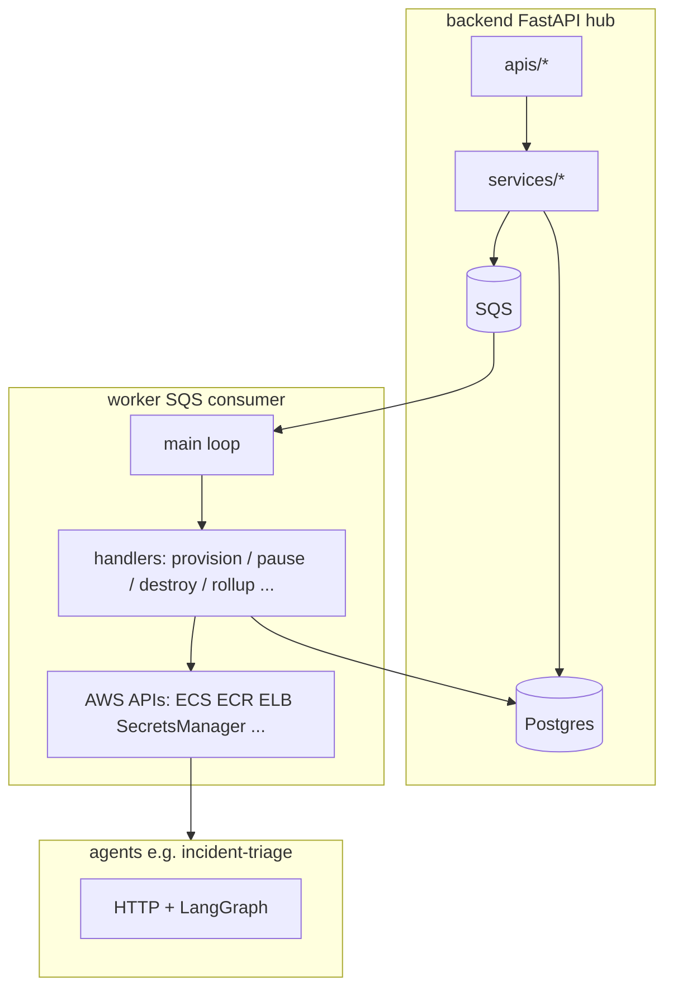

# LLM prompt: monorepo packaging, shared kernel, and job-driven worker

Copy everything below the line into a high-reasoning model when you want an external review of how to structure **shared code**, **deployables**, and **job orchestration** for this repository.

---

You are a principal software architect and staff-level Python engineer. You are designing how a **monorepo** should structure **shared code**, **deployables**, and **job orchestration** so the solution is **standard, explicit, testable, and future-proof**.

## A) Product and runtime architecture (must respect)

- **Hub (`backend/`)**: FastAPI **control plane** — HTTP API, auth/RBAC, Postgres registry (`tenants`, `users`, `agents`, `deployments`, `integrations`, `jobs`, …), **never** puts secrets in API responses except controlled OAuth flows. After committing durable rows, it **enqueues work** to **SQS** using a small JSON envelope (e.g. `job_id`, `tenant_id`, `job_type`, `correlation_id`, optional `agent_id`, safe `payload` with **ARNs / names / tags**, not secret values).
- **Worker (`worker/`)**: Long-running **SQS consumer** (same pattern locally against LocalStack and in AWS). It **loads `jobs` from Postgres by `job_id`**, advances **`jobs.status` / `job_step` / `error_message`**, and performs **orchestration side effects** against AWS (and updates **`agents`**, **`deployments`**, etc.) as the job type requires.
- **Agents (`agents/*`, e.g. `incident-triage/`)**: Separate **data-plane** containers (HTTP + LangGraph/Langfuse per plan). They are **not** the worker; they consume **Secrets Manager** by reference and run inference — provisioning of their **ECS/App Runner/ALB** resources is the **worker’s** job when instructed by jobs.
- **Postgres**: Single source of truth for **job state machines** and registry; hub and worker share one DB for capstone (replica later).
- **Infra sequencing (from project plan)**: **Local-first T0** — prove `hub → SQS → worker → Postgres` in Docker **before** heavy Terraform. Later: **`infra/localstack/`** (dev emulated AWS) and **`infra/hub/`** (App Runner) → **`infra/worker/`** → **`infra/agents/...`** with `terraform_remote_state` / shared **`infra/modules/*`** for queue URLs, RDS/SG outputs, etc. CI: **path-filtered** workflows per deployable.
- **Observability**: **Structured JSON logs** in hub, worker, and agents with a **shared minimum field contract** (`timestamp`, `level`, `service`, `correlation_id` or `request_id`, `job_id` for async work, `tenant_id` / `agent_id` when known) so CloudWatch/grep correlates **hub → SQS → worker → agent**.

## B) Worker responsibilities (job-driven — critical context)

The worker **does not** invent work from thin air; it **dispatches on `jobs.job_type` (and payload)** after reading the **`jobs` row** (authoritative) and optionally reconciling with the envelope. Planned / implied job families include at least:

1. **`agent_provisioning` (and variants)**
   - Pull / reference **ECR** image (repo + tag), register or update **ECS** (or App Runner) services, target groups, listeners, **IAM task roles**, **security groups**.
   - Wire **Secrets Manager** (naming like `secret:/agent-hub/{env}/tenant/{tenantId}/agent/{agentId}/...`) — job payload carries **ARNs and references**, **not** secret material (same rule as SQS: **no OAuth tokens / refresh tokens in messages**).
   - Wait for health / stabilize rollout; write **`deployments`** (cluster/service ARN, `base_url`, status) and transition **`agents.status`** (`draft` → `provisioning` → `active` or `failed`, etc. per domain rules).
   - Update **`jobs`** through **`queued` → `running` → `succeeded` / `failed`** with **`job_step`** for human-visible phases (e.g. `ecs_task_definition`, `service_stable`, `secrets_attached`).

2. **Pause / scale-down / “stop receiving traffic” jobs** (name as you standardize, e.g. `agent_pause`, `deployment_scale_to_zero`)
   - ECS service desired count → 0, draining, or ALB deregistration; persist **deployment** / **agent** status reflecting paused/draining semantics **without** destroying secrets or DB rows unless product says so.

3. **Destroy / deprovision jobs** (e.g. `agent_deprovision`, `agent_destroy`)
   - Tear down **ECS services**, tasks, possibly **ALB** rules, **CloudWatch** log groups if dedicated, **release** or **schedule deletion** of tenant-scoped secrets per policy, update **`agents`** to terminal states (`archived` / `deprovisioning` / `failed` as appropriate) and **`jobs`** to terminal outcomes.
   - Must be **idempotent** and safe on **SQS redelivery** (same `job_id`).

4. **Other async work (from plan)**
   - Examples called out in planning docs: **integration rotation**, **metrics rollup** (Langfuse → Postgres KPI snapshots), **ingestion** jobs later. Same **job row + SQS pointer** pattern.

### Cross-cutting worker rules

- **Idempotency**: SQS is **at-least-once**; handler design must use **`job_id`** (and DB constraints / conditional updates) so retries do not double-create ECS services or leak duplicate secrets.
- **DLQ**: Malformed messages or repeated handler failures should align with **visibility timeout + `maxReceiveCount` → DLQ**; document when the worker **`DeleteMessage`**s vs leaves for retry.
- **IAM**: On AWS the worker task role needs **SQS consume**, **RDS**, **ECS/ELB APIs**, **Secrets Manager** (scoped), **ECR pull** where applicable — hub role must **not** be a superset copy-paste; least privilege per service.
- **Local vs AWS**: Same **boto3** code paths; only **`AWS_ENDPOINT_URL`** and credentials differ (LocalStack dummy keys vs ECS task role).

## C) Current repository shape (source-level; omit `.venv` / `__pycache__`)

```text
agent-hub/
├── README.md
├── Agent.md
├── docker-compose.yml
├── docs/
│   └── plan.md                    # capstone plan: local-first T0, Terraform layout, worker handlers, secrets, CI
├── scripts/localstack-init/...
├── backend/
│   ├── pyproject.toml
│   ├── alembic.ini
│   ├── main.py                    # FastAPI
│   ├── core/                      # settings, database, sqs (hub producer + shared client)
│   ├── db/                        # ORM + Alembic migrations
│   ├── domain/
│   ├── schemas/                   # HTTP DTOs + sqs_job_envelope
│   ├── apis/
│   └── services/
├── worker/
│   ├── __main__.py
│   ├── main.py                    # poll loop (today: parse envelope, DB ping, delete on parse success)
│   ├── core/logging_setup.py
│   └── queue/sqs_receive.py
└── agents/incident-triage/
    └── src/main.py
```

**Target shape from `docs/plan.md` (informative — not all exists yet)** includes e.g. `worker/handlers/provision.py`, `worker/handlers/metrics_rollup.py`, optional `packages/shared/`, and `infra/*` per deployable.

## D) Relationship diagram (conceptual)



## E) The dilemma (“drama”) you must resolve

1. **Two+ deployables, one schema + one job contract** — Hub, worker, and agents must not fork **enums**, **`JobQueueEnvelope`**, **ORM models**, or **Alembic history**.
2. **Implicit imports today** — Worker may rely on **`PYTHONPATH`** including `backend/` so `import core.settings` works; that is fragile for Docker/CI and obscures **dependency edges**.
3. **Unclear folder semantics** — `core/` and `schemas/` mix unrelated concerns; as **many job types** and **AWS SDK modules** land in the worker, you want **names that teach** (config vs persistence vs messaging vs transport vs domain).
4. **Fat worker vs slim library** — Worker will accumulate **handlers** and AWS SDK usage; shared code should not force **FastAPI** or **hub-only** dependencies into agents or into a minimal worker image if avoidable.
5. **Alembic** must stay coherent with **`Base.metadata`** wherever models live.
6. **`docs/plan.md`** explicitly allows **`packages/shared/`** “only if needed” and shows **handler modules** under `worker/handlers/` — your packaging proposal should say whether **`packages/agent-hub-common`** (single kernel) vs **split packages** (e.g. `wire` + `kernel` + `api`) is better for this team and roadmap.

## F) Hard constraints

- **No secrets in SQS bodies**; payloads use **ARNs / resource names / safe metadata** only (see plan: Secrets Manager naming, ECS secret refs).
- **Standard Python packaging** (explicit deps; uv/poetry/pip-workspace acceptable).
- **Future-proof**: adding job types (`provision`, `pause`, `destroy`, `integration-rotate`, `metrics-rollup`) should not devolve into copy-paste enums or duplicate Pydantic models.
- **Separate prod IAM** per service remains true even if code is shared.

## G) Deliverable from you (the LLM)

Design a **robust, standard, future-proof** monorepo layout and packaging strategy that:

1. Gives **backend**, **worker**, and **agents** clean **`import ...`** paths **without** ad-hoc `PYTHONPATH` in production.
2. Locates **all shared + shared-soon** modules (settings, async DB engine/session, SQS client helpers, ORM + migrations, domain enums/exceptions/payload rules, `JobQueueEnvelope`, and HTTP DTOs **unless** you justify splitting DTOs from kernel) in a **well-named** package tree.
3. Explains how **`worker/handlers/**`** should depend inward on **domain + persistence + AWS adapter modules\*\* (hexagonal / ports style if you recommend it) so job orchestration stays testable.
4. Specifies **Alembic** placement and **exact dev/CI/Docker** commands.
5. Gives a **phased migration plan** from the **current** tree to your **target** tree.
6. Compares **one shared package** vs **multiple packages** with **tradeoffs** and a **recommended default** for a small team shipping the capstone on time.
7. Explicitly addresses **optional split** later (e.g. `agent-hub-wire` only for agents) **without** blocking current delivery.

**Output format:** executive summary → target tree → import examples → worker handler/job-type registry pattern → CI/Docker per image → risks/mitigations.

Assume Python **3.11+**, **SQLAlchemy 2 async**, **Pydantic v2**, **FastAPI** on hub, **boto3** on hub+worker, **Alembic** for migrations.

---

## Optional one-line preamble (for the chat UI)

Use high reasoning depth; treat worker job types (provision/pause/destroy and `docs/plan.md` async jobs) as first-class when designing packages and boundaries.
